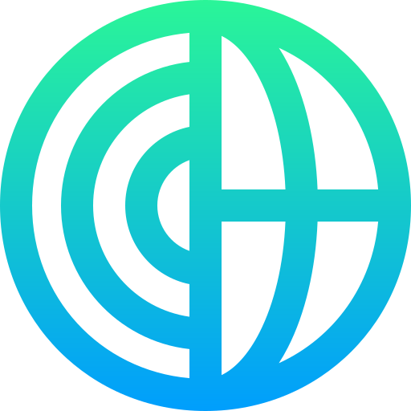

Updated: 2026-07-24

# 🌐 Interactive AI Portfolio & Autonomous Simulation Hub

<p align="center">
  
</p>

<p align="center">
  <strong>Osama Alam</strong> • <em>AI Architect & Founder</em>
</p>

<p align="center">
  
  <a href="https://github.com/Osamaalam/portfolio/pkgs/container/portfolio"></a>
  
  
  
</p>

---

Welcome to the official repository of my personal engineering portfolio. This is not just a static showcase, but a **high-fidelity, production-grade interactive platform** designed to simulate and visualize complex multi-agent workflows, computer vision (YOLOe segmentations), and customizable document RAG (Retrieval-Augmented Generation) semantic search engines.

🔗 **Explore Live Platform:** [osamaalam.com](https://osamaalam.com) *(or your deployed custom domain)*

---

## ✨ Features & Architecture

### 1. 🤖 Synapse Multi-Agent & Process Automation Sandbox
* Orchestrates real-time, context-aware cooperative loops between specialized autonomous agents (`System Architect`, `Software Engineer`, `QA Test Auditor`, `SecOps Guardian`).
* Supports fully custom prompt objectives, model temperature sliders, and authorized tool checkbox suites.
* **Human-in-the-Loop (HITL) manual correction**: Pauses and allows supervisor intervention during test failures to loop back, request engineer self-reflection, and auto-correct bugs.
* **0ms Intelligent Preset Caching**: Instantly delivers pre-verified pipelines with zero upstream network dependencies or cost overheads.

### 2. 🧠 Medical Pathological Scan Segmentation (Computer Vision)
* Mock computer vision classifier using a 3D slice-depth control dashboard (calibrated around ResNet-50 structures).
* Real-time Grad-CAM explainability logs and vascular variance anomaly flags matching hospital decision support setups.

### 3. 📂 Dynamic Document RAG Semantic Search
* **Real-Time Query Analysis:** Analyzing inputs dynamically to match indexed documents across major domains (Logistics, SaaS Revenue, Healthcare AI, and Web3 Solidity).
* **Interactive Suggestion Chips:** Preset tags allowing users to instantly cycle through preloaded document scopes and compare dynamic vector match lists and synthesized summaries.
* **Smart Fallback:** Custom search inputs generate dynamically matching chunk IDs and real-time semantic summaries based on user input.

### 4. 🌗 Premium Neon Adaptable Theme
* Full, seamless Day and Night themes utilizing CSS custom properties and custom transitions.
* **Accessibility-First Contrast:** Modified base-class compiler overrides that guarantee 100% visible, high-contrast, and comfortable reading under any lighting, while fully preserving rich color hover-state animations.
* **Tailwind v4 specificity-locking:** Forced CSS custom class mapping to prevent automatic browser overrides from bleeding into dark tech terminals.

### 5. 📬 Secure Portable Lead Capture (n8n Integration)
* Next.js API endpoint (`/api/contact`) that securely packages customer contact information.
* Replaced native process calls with modern, highly portable Node.js `fetch` APIs using secure Base64 Basic Authentication to forward inquiries asynchronously to my **n8n orchestration workflow**.

### 6. 👁️ Multi-Engine AI Vision & YOLOe Segmentation Sandbox
* **Client-Bound Tesseract.js**: Client-bound, fully local, private browser-side text extraction executing natively in browser memory.
* **Vision LLM Q&A**: Multimodal visual analysis allowing users to upload documents and type custom questions to get structured markdown reports or summaries.
* **Real YOLOe Instance Segmentation**: Spawns a Python `ultralytics` model instance on the server to execute `yoloe-11s-seg.pt` on your uploaded image, dynamically isolating and painting glowing translucent masks matching your specific named target object (e.g. `laptop`, `cup`).

### 7. 🎙️ AI Speech & Audio Processing Sandbox
* **Audio-to-Text Transcription:** Ingests your uploaded audio file (mp3, wav, m4a up to 2MB) and transcribes it natively via a fast backend multimodal decoder socket.
* **Factual Text Restructuring:** Feeds raw transcription outputs directly into a paid, semantic note compiler to convert loose speech streams into beautifully structured study-notes, summaries, or reports based on custom instructions.

---

## 🛠️ Stack & Technologies

* **Frontend Framework:** Next.js v16.2 (App Router with Turbopack compilation)
* **Styling & Transitions:** Tailwind CSS v4.0 (Utilizing custom class-based dark variant)
* **Runtime & Package Manager:** Node.js v22 & npm v10.9
* **Containerization:** Debian-based standalone pipeline (`node:22-bookworm-slim` with Python virtual environments, PyTorch CPU, and Ultralytics)
* **CI/CD & Registries:** GitHub Actions & GitHub Container Registry (`ghcr.io`)

---

## 📦 Docker Containerization & Deployment

This project utilizes a highly optimized **multi-stage build workflow** that outputs a standalone production-grade container. By leveraging Next.js **standalone build outputs** and CPU-only PyTorch libraries, the final image is extremely fast, highly compatible, and packages your deep-learning YOLOe weights securely.

### Launch with Docker Compose (Recommended)
We provide a pre-configured `docker-compose.yml` to spin up the container as a detached background daemon with auto-restart:
```bash
# 1. Pull the fresh image from GHCR
docker compose pull

# 2. Launch the container
docker compose up -d
```

### Pull the Image from GitHub Container Registry
```bash
docker pull ghcr.io/osamaalam/portfolio:latest
```

---

## 💻 Local Development

Follow these steps to run and develop the portfolio locally:

### 1. Prerequisites
* **Node.js (>= 20.9)** and **npm** package manager.
* **Python (>= 3.8)** and **pip** (required if you wish to run local YOLOe segmentations):
  ```bash
  pip install ultralytics torch torchvision
  ```

### 2. Installation
Clone the repository and install the dependencies:
```bash
git clone https://github.com/Osamaalam/portfolio.git
cd portfolio
npm install
```

### 3. Running Development Server
Start the local server with Next.js Turbopack:
```bash
npm run dev
```
Open [http://localhost:3000](http://localhost:3000) with your browser.

### 4. Production Compilation & Linting
Verify code health and perform a complete production compile:
```bash
# Run ESLint validation checks
npm run lint

# Compile and optimize for production
npm run build

# Start the compiled production server
npm run start
```

---

## 🔒 Security & Code Compliance

This project enforces modern, bulletproof engineering standards:
* **Strict Non-Root Isolation:** Spawns backend deep-learning scripts inside isolated sub-processes.
* **Safe Input Sanitization:** All dynamic API inputs (Target Object, Prompts, Queries, Contact Data) are strictly truncated and regex-sanitized on the backend to eliminate injection vectors.
* **CORS-Free Geolocation Cache:** Integrates a secure client-assisted server-side proxy mapped with `sessionStorage` caching, saving your external API budget and completely avoiding browser CORS blocks.

---

<p align="center">
  Designed & Built with ❤️ by <strong>Osama Alam</strong>
</p>